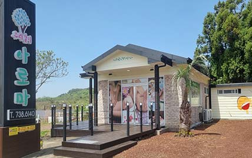
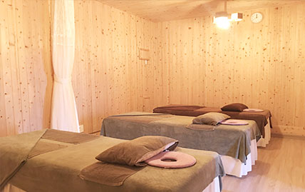
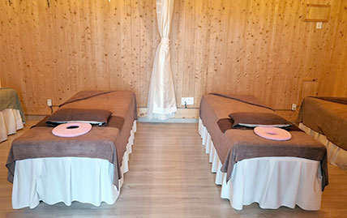
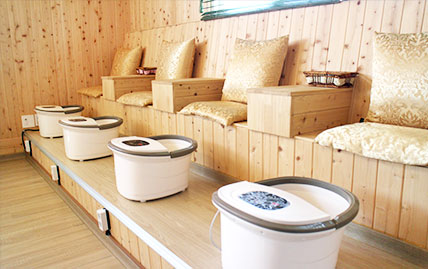
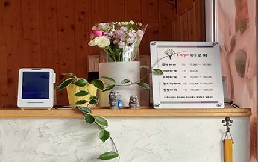

# Woori Aroma Booking System

> **One Time. One Team.**  
> A multilingual booking and operations platform for **Woori Aroma**, a private spa in Jungmun, Jeju Island.

<p align="center">
  
</p>

<p align="center">
  <strong>Woori Aroma · Jungmun, Jeju</strong><br/>
  Private spa · One Time. One Team.
</p>

> **Photo source:** Verified public Woori Aroma listing images matching the business name and address  
> `제주특별자치도 서귀포시 중문관광로 285`.  
> The project owner has permission from the business owner to use these Woori Aroma photos.

---

## Overview

Woori Aroma currently uses Calendly for online reservations.

Current booking page:

**https://calendly.com/wooriaroma**

This project replaces the generic scheduling experience with a dedicated reservation system designed around Woori Aroma's actual operating model.

The product has two main interfaces:

| Interface | Main users | Language |
|---|---|---|
| Customer Booking Website | International travelers visiting Jeju | Multilingual, English default |
| Admin Dashboard | Korean Woori Aroma staff | Korean |

The customer booking site should be highly mobile-friendly because many customers are expected to arrive from **Google Maps, Google Search, Instagram, hotel recommendations, and direct links**.

---

## Woori Aroma

**Woori Aroma (우리같이아로마)** is a private spa located in Jungmun, Seogwipo, Jeju Island.

- Location: Jungmun, Seogwipo, Jeju
- Business model: Private spa
- Maximum group size: 4 guests
- Core concept: **One Time. One Team.**
- Current reservation tool: Calendly
- Main international acquisition channel: Google Maps / Google Search

### Location

**285 Jungmungwangwang-ro, Jungmun-dong, Seogwipo-si, Jeju-do, South Korea**

Google Maps should be connected to the final booking confirmation experience through a **View Location** action.

### Actual Woori Aroma Photos

#### Exterior

<p align="center">
  
</p>

#### Treatment Rooms

<p align="center">
  
  
</p>

#### Foot Bath Area

<p align="center">
  
</p>

#### Reception

<p align="center">
  
</p>

### Image Assets Included in This Project

```text
docs/
└── images/
    ├── woori-aroma-exterior.jpg
    ├── woori-aroma-treatment-room-1.jpg
    ├── woori-aroma-treatment-room-2.jpg
    ├── woori-aroma-footbath.jpg
    └── woori-aroma-reception.jpg
```

These are actual Woori Aroma images from a public business listing matching the shop name and address.  
Do not replace them with generic stock spa photography unless intentionally redesigning the brand imagery.

---

# Product Goal

Create a dedicated reservation experience that turns Google Maps visitors into confirmed bookings with as little friction as possible.

```text
Google Maps / Search / Instagram
              ↓
       Woori Aroma Website
              ↓
        Choose Guests
              ↓
       Choose Treatment
              ↓
       Choose Date & Time
              ↓
       Customer Details
              ↓
        Booking Review
              ↓
        Deposit Payment
              ↓
     Reservation Confirmed
              ↓
      Admin Dashboard
```

The platform should eventually replace fragmented reservation management across Calendly, messages, and manual tracking.

---

# Customer Experience

## Default language

The customer-facing booking website uses **English as the default language**.

Supported languages:

- English
- 한국어
- 中文
- 日本語

The website should detect the visitor's browser/device locale on the first visit.

Example:

```text
Japanese browser → Japanese
Korean browser   → Korean
Chinese browser  → Chinese
English browser  → English
Other language   → English
```

Customers must also be able to manually change the language.

Manual selection must override automatic language detection and persist across future visits.

Suggested implementation:

```text
next-intl
+
locale-aware routes
+
cookie or localStorage preference
```

Suggested routes:

```text
/en/book
/ko/book
/zh/book
/ja/book
```

Changing the language must **not reset booking state**.

---

# Booking Flow

## 1. Landing

Suggested positioning:

> **PRIVATE SPA · JEJU**
>
> A private spa experience in Jeju, exclusively for you and your group.
>
> **One Time. One Team.**
>
> Up to 4 Guests.

Primary CTA:

**Book Your Experience**

The landing page should be short and conversion-oriented rather than a long corporate website.

---

## 2. Choose Guests

Customers can select:

```text
1 Guest
2 Guests
3 Guests
4 Guests
```

Minimum capacity: **1**

Maximum capacity: **4**

A reservation always represents **one private group**, regardless of group size.

---

## 3. Choose Treatment

### Aroma Oil

| Duration | Price / Person |
|---:|---:|
| 60 min | ₩100,000 |
| 90 min | ₩140,000 |
| 120 min | ₩180,000 |

**90 minutes should be highlighted as Recommended.**

### Hot Stone

| Duration | Price / Person |
|---:|---:|
| 90 min | ₩160,000 |
| 120 min | ₩200,000 |
| 150 min | ₩250,000 |

### Facial

Facial options should be configurable and expandable without modifying booking components.

Service definitions should live in centralized configuration rather than being hardcoded throughout JSX.

Example:

```text
data/services.ts
```

---

# Reservation Rules

The booking engine must follow Woori Aroma's actual operating model.

## One group at a time

Woori Aroma does **not** accept simultaneous reservations from unrelated groups.

A group of one guest and a group of four guests both occupy the entire booking slot.

```text
Reservation A exists
       ↓
No Reservation B may overlap it
```

## Preparation and reset buffer

Every appointment requires:

- **60 minutes before** the treatment for preparation
- **60 minutes after** the treatment for cleanup/reset

Example:

```text
Aroma Oil 90 min

Service:
16:00 ───────────── 17:30

Blocked period:
15:00 ───────────────────── 18:30
```

Another reservation cannot overlap any part of the blocked period.

Core availability functions should be kept outside UI code.

Suggested functions:

```ts
calculateBlockedTime()
checkBookingConflict()
generateAvailableSlots()
```

The server must verify availability again immediately before a reservation is committed to prevent double booking.

---

# Pricing

Total treatment price:

```text
Price per person × Number of guests
```

Example:

```text
Aroma Oil 90 min
₩140,000 × 2 guests
= ₩280,000
```

## Deposit

Deposit policy:

```text
₩10,000 × Number of guests
```

| Guests | Deposit |
|---:|---:|
| 1 | ₩10,000 |
| 2 | ₩20,000 |
| 3 | ₩30,000 |
| 4 | ₩40,000 |

The remaining amount is paid at the spa.

---

# Customer Details

The booking form should collect:

- Name
- Phone / WhatsApp
- Email
- Country
- Preferred Language
- Special Requests

International phone numbers must be supported.

The customer's **UI locale** and **preferred communication language** should be stored separately.

Example:

```text
Website language: English
Preferred communication language: Japanese
```

---

# Booking Confirmation

A successful reservation should show:

```text
Reservation Confirmed

Reservation Number
WA-20260812-001

Date
August 12, 2026

Time
4:00 PM

Guests
2

Treatment
Aroma Oil · 90 min

Deposit Paid
₩20,000

Remaining Balance
₩260,000
```

Actions:

- View Location
- Add to Calendar
- Contact Us

Future integrations:

```text
View Location     → Google Maps
Add to Calendar   → Google Calendar / .ics
Contact Us        → WhatsApp
```

---

# Admin Dashboard

The administrator dashboard will be used by Korean staff and should therefore be **Korean only**.

Suggested route:

```text
/admin
```

The admin interface should not automatically change language based on browser locale.

## Core admin features

### 오늘 현황

- 오늘 예약 팀 수
- 오늘 방문 인원
- 예상 매출
- 받은 예약금

### 예약 관리

- 예약 목록
- 일/주/월 캘린더
- 예약 상세
- 예약 추가
- 예약 변경
- 예약 취소
- No-show 처리

### 시간 관리

- 특정 시간 차단
- 휴무일 설정
- 영업시간 설정

### 고객 관리

- 고객 정보
- 방문 횟수
- 최근 방문
- 선호 언어
- 예약 이력
- 특이사항

### 서비스 관리

- 프로그램 활성/비활성
- 가격 변경
- 소요시간 변경
- 예약금 정책

### 유입 경로

Track reservation source:

```text
GOOGLE_MAPS
GOOGLE_SEARCH
INSTAGRAM
NAVER
HOTEL
DIRECT
REPEAT
```

This allows Woori Aroma to understand which channels actually generate bookings and revenue.

---

# Proposed Architecture

```text
                     ┌──────────────────────────┐
                     │      Google Maps         │
                     │ Google Search / Instagram│
                     └─────────────┬────────────┘
                                   │
                                   ▼
                     ┌──────────────────────────┐
                     │ Customer Booking Website │
                     │ Next.js + TypeScript     │
                     │ Multilingual             │
                     └─────────────┬────────────┘
                                   │
                            HTTPS / API
                                   │
                                   ▼
                     ┌──────────────────────────┐
                     │   Cloudflare Workers     │
                     │ Reservation API / Logic  │
                     └─────────────┬────────────┘
                                   │
                                   ▼
                     ┌──────────────────────────┐
                     │      Cloudflare D1       │
                     │      SQLite Database     │
                     └─────────────┬────────────┘
                                   │
                                   ▼
                     ┌──────────────────────────┐
                     │    Admin Dashboard       │
                     │       Korean UI          │
                     └──────────────────────────┘
```

---

# Technology Stack

## Frontend

- Next.js
- App Router
- TypeScript
- Tailwind CSS
- `next-intl`
- Mobile-first responsive UI

## Hosting / API

Preferred initial infrastructure:

- Cloudflare
- Cloudflare Workers

## Database

Preferred initial database:

- Cloudflare D1

D1 is sufficient for the initial Woori Aroma reservation workload and keeps hosting, API, and database infrastructure within the same ecosystem.

## Future integrations

- Payment gateway
- Google Maps
- Google Calendar
- WhatsApp
- SMS
- Kakao
- Email notifications
- Analytics

---

# Database Concept

Recommended initial tables:

```text
customers
services
reservations
reservation_guests
blocked_times
```

Future tables:

```text
payments
notifications
admin_users
audit_logs
```

## `customers`

Stores the person responsible for the booking.

Possible fields:

```text
id
name
phone
email
country
preferred_language
created_at
updated_at
```

## `services`

```text
id
code
duration_minutes
price_per_person
is_active
created_at
updated_at
```

Display names and marketing descriptions should remain in translation/configuration resources rather than being duplicated unnecessarily in the database.

## `reservations`

Important fields:

```text
id
reservation_number
customer_id
guest_count
service_id

service_start
service_end

blocked_start
blocked_end

total_amount
deposit_amount
remaining_amount

source
status
locale

special_request

created_at
updated_at
```

Potential statuses:

```text
PENDING
CONFIRMED
COMPLETED
CANCELLED
NO_SHOW
```

## `reservation_guests`

Prepared for future per-guest treatment selection.

```text
id
reservation_id
guest_number
service_id
duration_minutes
price
```

Example future reservation:

```text
Reservation #WA-001

Guest 1 → Aroma Oil 90
Guest 2 → Aroma Oil 90
Guest 3 → Hot Stone 90
```

The entire group still remains **one reservation**.

## `blocked_times`

Used for:

- manual time blocks
- shop closures
- maintenance
- private events
- temporary unavailable periods

---

# API Concept

The browser should never directly write reservation data to D1.

Architecture:

```text
Browser
  ↓
API
  ↓
Validation
  ↓
Conflict Check
  ↓
D1
```

Suggested endpoints:

```http
GET /api/availability?date=2026-08-12

POST /api/reservations

GET /api/reservations/:reservationNumber
```

Admin endpoints will be protected separately later.

---

# Double Booking Protection

This is a critical requirement.

Two customers may see the same available time before either customer completes the reservation.

Therefore availability must be validated twice:

```text
1. Show available slots
2. Customer selects a slot
3. Customer submits reservation
4. Server checks availability AGAIN
5. If still available → create reservation
6. If no longer available → reject and return refreshed slots
```

Never trust availability calculated only in the browser.

---

# Project Structure

Suggested structure:

```text
app/
├── [locale]/
│   └── book/
└── admin/

components/
├── booking/
├── admin/
├── common/
└── language/

data/
└── services.ts

lib/
├── booking/
│   ├── availability.ts
│   └── pricing.ts
├── db/
└── i18n/

messages/
├── en.json
├── ko.json
├── zh.json
└── ja.json

types/
└── booking.ts

docs/
└── images/
```

---

# Photography Direction

The real Woori Aroma photographs in `docs/images/` should be treated as the primary visual reference for the booking website.

Recommended use:

| Asset | Recommended UI use |
|---|---|
| `woori-aroma-exterior.jpg` | Landing hero, location section, booking confirmation |
| `woori-aroma-treatment-room-1.jpg` | Private group / up-to-4-guests messaging |
| `woori-aroma-treatment-room-2.jpg` | Treatment selection or experience section |
| `woori-aroma-footbath.jpg` | Service details / spa experience |
| `woori-aroma-reception.jpg` | About / contact / location section |

Design the website around the real space: warm wood, bright natural interiors, quiet private rooms, and a standalone Jeju location.

Avoid generating a visual identity that contradicts the actual shop.

---

# UI Direction

The visual identity should feel like:

```text
Jeju private spa
+
boutique hotel
+
minimal wellness brand
```

Suggested palette:

- Warm ivory
- Sand
- Beige
- Charcoal
- Muted olive

Avoid:

- generic SaaS styling
- excessive gradients
- neon colors
- excessive shadows
- unnecessary animations

Use typography, photography, spacing, and calm interactions to create a premium atmosphere.

---

# MVP Scope

## Phase 1 — Customer Booking UI

- [ ] Landing
- [ ] Language detection
- [ ] Language switcher
- [ ] Guest selection
- [ ] Treatment selection
- [ ] Duration selection
- [ ] Calendar
- [ ] Time selection
- [ ] Customer details
- [ ] Booking review
- [ ] Mock deposit payment
- [ ] Confirmation

## Phase 2 — Backend & Database

- [ ] Cloudflare project configuration
- [ ] D1 database
- [ ] Database migrations
- [ ] Availability API
- [ ] Reservation API
- [ ] Conflict validation
- [ ] Reservation number generation
- [ ] Error handling

## Phase 3 — Admin Dashboard

- [ ] Korean admin interface
- [ ] Admin authentication
- [ ] Today's reservations
- [ ] Calendar
- [ ] Reservation detail
- [ ] Manual reservation
- [ ] Modify / cancel reservation
- [ ] Block time
- [ ] Customer list
- [ ] Service management

## Phase 4 — Payments & Notifications

- [ ] Real deposit payment
- [ ] Payment verification
- [ ] Confirmation email
- [ ] WhatsApp notification
- [ ] Admin notification
- [ ] Cancellation flow

## Phase 5 — Growth

- [ ] Google Maps reservation link
- [ ] Source attribution
- [ ] Analytics
- [ ] Review request automation
- [ ] Repeat customer CRM
- [ ] AI reservation assistant

---

# Development Principles

1. **Mobile first**
2. **Do not lose booking state when switching language**
3. **Do not hardcode business data throughout components**
4. **Keep business logic outside UI components**
5. **The server is the source of truth for availability**
6. **Prevent double bookings**
7. **Design for one reservation = one private group**
8. **Make admin operations possible without touching the database directly**
9. **Use migrations for database schema changes**
10. **Keep the MVP simple while preserving clean extension points**

---

# Current Reference

Current reservation page:

**https://calendly.com/wooriaroma**

The goal is not to copy Calendly.

The goal is to retain its simplicity while creating a reservation experience built specifically for Woori Aroma.

---

# Long-Term Vision

The project should evolve from a booking form into Woori Aroma's lightweight operating system.

```text
Customer Acquisition
       ↓
Booking
       ↓
Deposit
       ↓
Visit
       ↓
Customer History
       ↓
Review
       ↓
Repeat Visit
```

The final system should help answer questions such as:

- How many bookings came from Google Maps?
- Which treatment generates the most revenue?
- How many international customers visited this month?
- What language do customers prefer?
- Which customers have visited multiple times?
- What is tomorrow's expected revenue?
- Which time periods are most frequently booked?

The system should remain simple enough for the spa staff to operate without technical knowledge.
